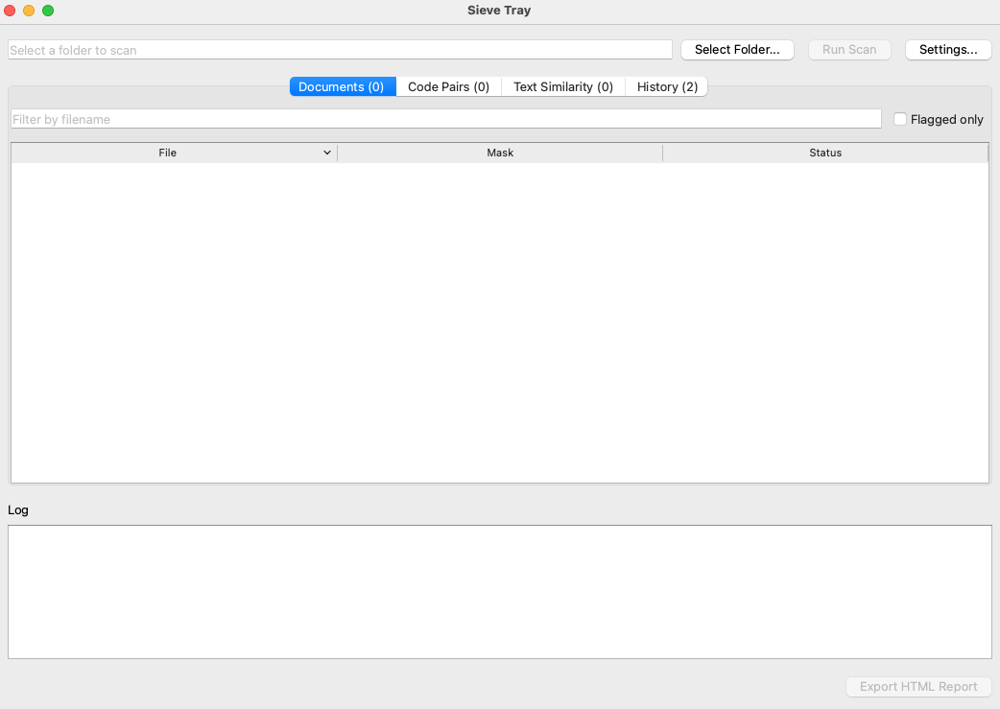
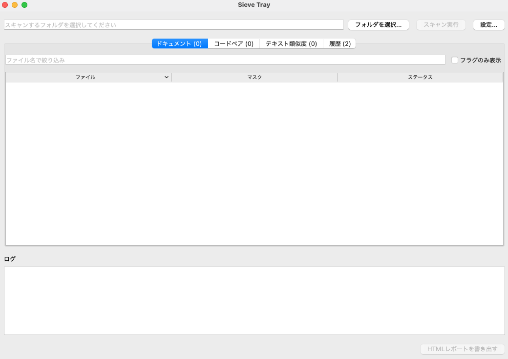
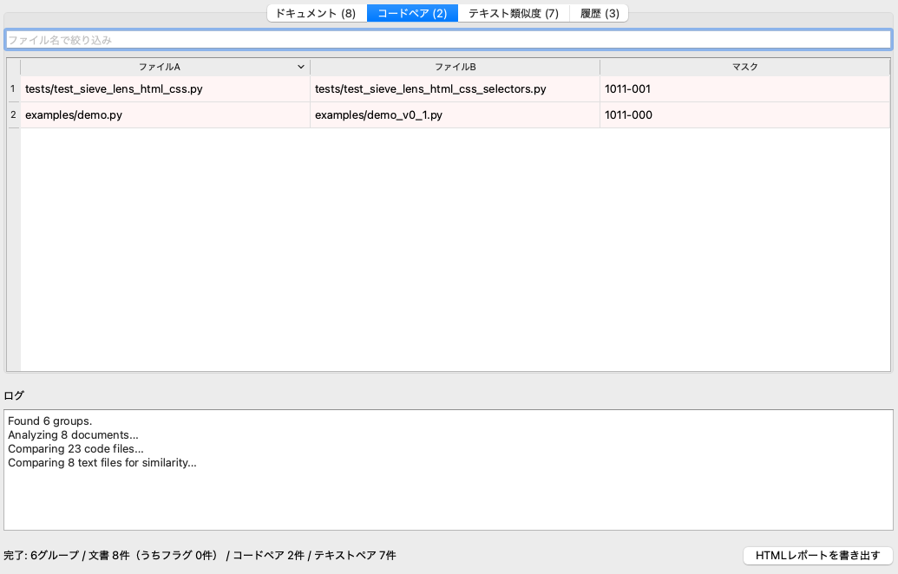
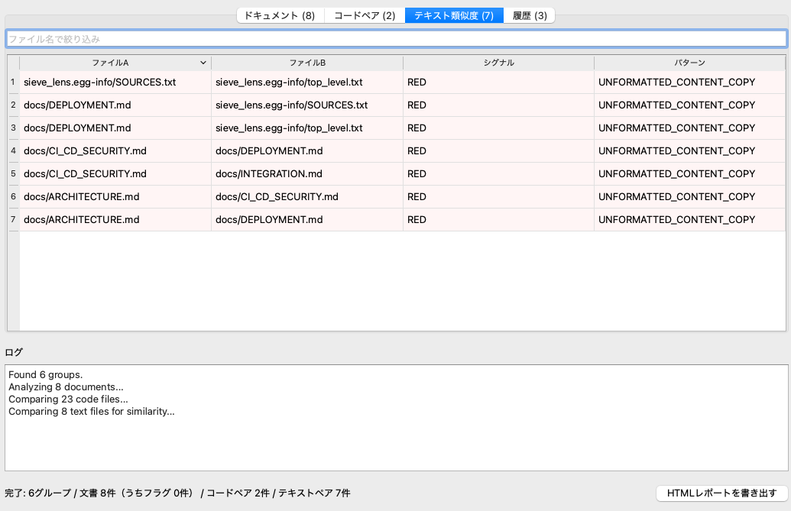

[English](README.md) | **日本語**

# Sieve Tray v0.3.0

**汎用観測ツール — Sieveシリーズのデスクトップフロントエンド**

> [Sieve Lens](https://github.com/neguseatama/sieve-lens)の不可視コンテンツ観測、
> [Sieve Scope](https://github.com/neguseatama/sieve-scope)のコード類似度検知、
> [Sieve Referee](https://github.com/neguseatama/sieve-referee)のテキストパラフレーズ検知を、
> 1つのデスクトップアプリに統合しました。提出物のフォルダを指定するだけで、
> 不可視のコンテンツや隠されたプロンプトを含む文書、構造的に疑わしく似ているコードペア、
> 言い換え・流用の疑いがあるテキストペアを、一度にまとめて検出、報告します。

[](https://github.com/neguseatama/sieve-tray/actions/workflows/test.yml)
[](https://github.com/neguseatama/sieve-tray/actions/workflows/release.yml)
[](https://opensource.org/licenses/MIT)
[](https://www.python.org/)

---

## 💡 コンセプト

[Sieve Lens](https://github.com/neguseatama/sieve-lens)は「この文書には、人間には
見えないがパーサには読める何かが含まれていないか」を、
[Sieve Scope](https://github.com/neguseatama/sieve-scope)は「この2つのソースコードは、
偶然とは思えないほどロジックが似ていないか」を、
[Sieve Referee](https://github.com/neguseatama/sieve-referee)は「このテキストは、
あちらのテキストを言い換えただけではないか」を、それぞれ観測します。いずれも
Sieveシリーズらしい、外部依存ゼロ・決定論的な観測エンジンですが、提出物フォルダを
実際にチェックするには、これらを別々に走らせ、結果を自分で突き合わせる必要が
ありました。

**Sieve Tray**はその手間をなくします。1提出者につき1サブフォルダ、という構造の
フォルダを指定するだけで、ファイルごとに適切なエンジンへ自動的に振り分けます
（文書はSieve Lensへ、`.py`ファイルはSieve Scopeのペア比較へ、プレーンテキスト
（`.txt`/`.md`）はさらにSieve Refereeのペア比較へ）。結果は1つのウィンドウに
まとまり、履歴が残るので再スキャンは不要、さらにどの観測軸が反応し、その根拠が
何だったかまで詳細表示で確認できます。単なる「白黒の判定」ではなく、エンジンが
実際に観測した事実だけを提示します。

> 他のSieveシリーズ同様、これは**観測ツールであって、判定ツールではありません**。
> フラグが立つことは「人間が確認すべき」という意味であり、「不正が確定した」という
> 意味ではありません。

---

## 🔥 主な特徴

- **フォルダ1つで全部チェック** — `.py`ファイルはSieve Scopeへ、プレーンテキスト
  （`.txt`、`.md`）はさらにSieve Refereeへ、全ての文書（`.html`、`.docx`、`.pdf`、
  画像を含む）はSieve Lensへ、拡張子で自動的に振り分け
- **バックグラウンドスレッドで動くGUI** — 大量の提出物でもスキャン中にウィンドウが
  固まらない
- **英語・日本語UI** — 設定画面からいつでも切り替え可能（デフォルトは英語）。なお
  Sieve Refereeが生成する判定理由の説明文は、エンジンの閾値調整が日本語前提のため、
  UI言語に関わらず常に日本語で出力されます。詳細ダイアログにはその旨を明記した上で
  表示します
- **ソート・フィルタ可能な結果テーブル** — 列見出しクリックで並び替え、ファイル名や
  「フラグのみ表示」で絞り込み可能
- **詳細ダイアログ** — 行をダブルクリックすると、マスク文字列だけでなく観測軸ごとの
  結果と、エンジンが記録した根拠・スコア・理由まで確認できる
- **ローカル履歴** — スキャンのたびにローカルのSQLiteデータベース
  （`~/.sieve_tray/history.db`）に自動保存。再スキャンせずに過去の結果を見返せる
- **設定可能** — レポートの保存先フォルダ、履歴の保持件数、UI言語を、設定画面から
  変更可能
- **自己完結型HTMLエクスポート** — どの結果も、共有・保管しやすい単体のHTML
  レポートとして書き出せる
- **完全ローカルで動作** — スキャンは100%お使いの端末内で完結します。提出物の中身が
  外部に送信されることはなく、クラウドへのアップロードもAPI通信も一切発生しません
- **コアはゼロ依存** — スキャンエンジン本体（`sieve_tray.py`）はPython標準ライブラリと
  Sieve Lens / Sieve Scope / Sieve Refereeのみに依存。GUIはその上に載る任意のレイヤー
  （`PySide6`）として分離してあり、Sieveシリーズ全体の「外部依存ゼロ・オフライン・
  決定論的」という設計思想をコア部分では保っています
- **クロスプラットフォーム配布** — CIがPyInstallerでWindows・macOS（Apple Silicon /
  Intel）向けの単体アプリを自動ビルド。実行にPythonのインストールは不要

---

## 📦 インストール

### 方法1: ビルド済みアプリをダウンロード（推奨）

Pythonのインストールは不要です。
[Releasesページ](https://github.com/neguseatama/sieve-tray/releases)から、
お使いの環境に合ったものをダウンロードしてください。

| プラットフォーム | ファイル |
|---|---|
| Windows | `SieveTray-windows.zip` |
| macOS（Apple Silicon / M系） | `SieveTray-macos-arm64.zip` |
| macOS（Intel） | `SieveTray-macos-intel.zip` |

展開して`SieveTray.exe` / `SieveTray.app`を起動してください。初回起動時、macOSでは
「開発元を確認できません」という警告が出ます（未署名ビルドのため想定内です）。
**システム設定 → プライバシーとセキュリティ**から「このまま開く」を選んでください。
Windowsでも同様にSmartScreenの警告が出ることがあります。「詳細情報 → 実行」を
選んでください。

### 方法2: ソースからインストール

```bash
git clone https://github.com/neguseatama/sieve-tray.git
cd sieve-tray
python3 -m venv .venv && source .venv/bin/activate
pip install -e ".[gui]"
python3 sieve_tray_gui.py
```

Python 3.10〜3.13が必要です（PySide6はまだ3.14に対応していません）。

コアのみ（GUIなし、CLI利用・スクリプト用途向け）:

```bash
pip install -e .
```

---

## 💻 クイックスタート

### GUI

1. アプリを起動
2. 「フォルダを選択...」から、1提出者につき1サブフォルダという構造のフォルダを選択
3. 「Run Scan」をクリック
4. 「Documents」「Code Pairs」「Text Similarity」タブで結果を確認 — 列見出しで
   並び替え、ファイル名で絞り込み、行をダブルクリックで観測軸ごとの詳細を表示
5. 「Export HTML Report」で共有可能なレポートを出力。過去のスキャンは常に
   「History」タブから確認できます

（UI言語のデフォルトは英語です。設定画面から日本語に切り替えられます。切り替えは
再起動後に反映されます）

### CLI

```bash
python3 sieve_tray.py path/to/submissions -o report.html
```

1提出者につき1サブフォルダという構造のディレクトリを想定しています。

```
submissions/
    student_a/
        essay.docx
        solution.py
    student_b/
        essay.docx
        solution.py
```

### ライブラリとして

```python
from pathlib import Path
from sieve_tray import run_scan, render

result = run_scan(Path("submissions"), progress=print)
print(result.doc_results)   # path / mask / flagged / h_states / evidence
print(result.code_pairs)    # a / b / mask / h_states / scores
print(result.text_pairs)    # a / b / signal / mask / pattern_name / reason / h_states / scores

Path("report.html").write_text(render(result))
```

---

## 🖼️ スクリーンショット

| 英語UI | 日本語UI |
|---|---|
|  |  |

| コードペアタブ | テキスト類似度タブ |
|---|---|
|  |  |

---

## 🔬 テスト

```bash
pip install -e . pytest
pytest -v
```

コアのスキャン/レンダリング処理（CSSレンダリングバグやSieve Refereeのパラフレーズ
検知の回帰テストを含む）、履歴・設定のストレージ層（保存・読み込み・削除・保持件数
による自動整理、Referee導入前のDBからの移行を含む）、i18n文字列テーブル（英語・
日本語のキー整合性）を合わせて23件のテストでカバーしています。

CIはpushのたびにこのテストスイートを実行し（Ubuntu上でPython 3.10・3.12）、
バージョンタグをpushするたびにWindows/macOS向けデスクトップアプリをビルドします。

---

## ⚠️ 既知の制限

1. **コード比較はPythonのみ対応。** Sieve Scopeへ振り分けられるのは`.py`のみで、
   他言語は現状ただの文書として扱われる（または無視される）
2. **テキスト類似度比較はプレーンテキストのみ対応。** Sieve Refereeへ振り分けられる
   のは`.txt`/`.md`のみ。`.docx`/`.pdf`などのリッチな形式は、Sieve Lensによる個別の
   観測は行われるものの、現状このテキスト比較のためにプレーンテキスト抽出はしていない
3. **Sieve Refereeの`reason`（判定理由）はUI言語に関わらず日本語のみ。** エンジンの
   類似度閾値が日本語テキストを前提に調整されているため。詳細ダイアログにはその旨を
   明記した上で表示する
4. **配布ビルドは未署名。** Windows SmartScreenとmacOS Gatekeeperが初回起動時に
   警告を出す。未署名ビルドとしては想定内の挙動
5. **観測ツールであって、判定ツールではない**（Sieve Lens・Sieve Scope・Sieve
   Refereeから継承した姿勢）。フラグは「人間の確認が必要」という意味であり、「不正が
   確定した」という意味ではない

---

## 📚 関連プロジェクト

- [Sieve Lens](https://github.com/neguseatama/sieve-lens) — 不可視コンテンツ観測
  エンジン（文書向け）
- [Sieve Scope](https://github.com/neguseatama/sieve-scope) — コード類似度検知
  エンジン
- [Sieve Referee](https://github.com/neguseatama/sieve-referee) — テキスト
  パラフレーズ・盗用検知エンジン

---

## 📄 ライセンス

MIT License. 詳細は[LICENSE](LICENSE)を参照してください。

---

## 👤 作者

* **Kai IWASAKI**
